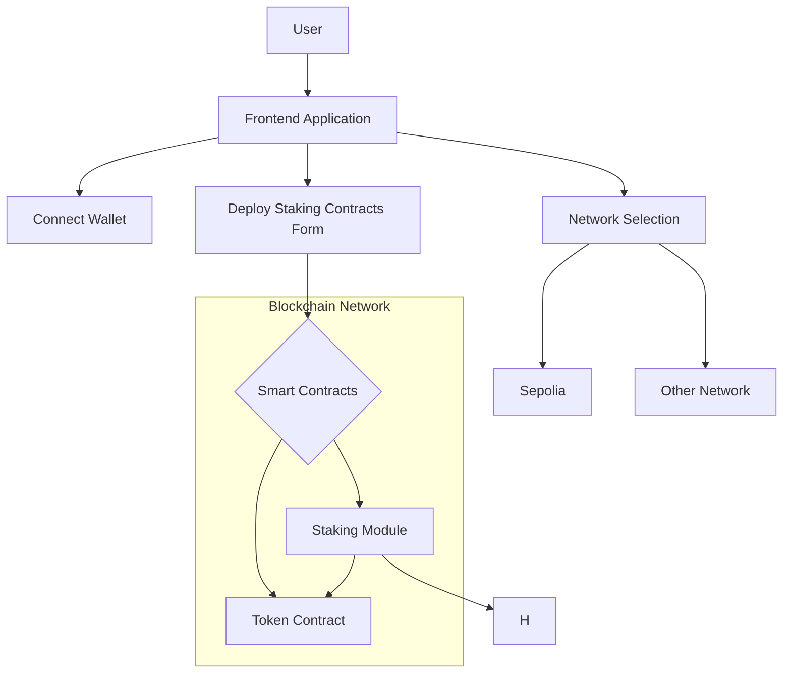

# Encode Solidity Bootcamp Q2 2024 - Final Project (Group 7)

## Table of Contents
- [About](#about)
- [Description of Project](#description-of-project)
- [Installation and Initialization](#installation-and-initialization)
- [High Level Design](#high-level-design)
- [Low Level Design (including directory structure)](#low-level-design-including-directory-structure)
- [References](#references)
- [Acknowledgements](#acknowledgements)

## About
A decentralized application (DApp) for deploying and staking tokens
- Project PPT, [here](https://docs.google.com/presentation/d/1WeDXMRLH5CgoY6WR5GYedXd1Aj11W19T/edit?usp=sharing&ouid=109898555287264560472&rtpof=true&sd=true)

### Description of Project
This repository contains the code for creating a staking DApp. It is a platform for people to create a token with provided parameters and others can come and stake their token for specified APR (return) on their token. Deployer can specify user stake limit , total stake limit , max number of stakes per user and APR. They can Adjust APR and staking limits , and Withdraw and add tokens.

### Installation and Initialization
- **Step 1:** Install `node` for your system and OS. Refer [here](https://nodejs.org/en/download/package-manager) for more details.
- **Step 2:** Clone the directory and `cd` into it
```
git clone git@github.com:Aravinds2511/Final-Project.git
cd Final-Project
```
- **Step 3:** Install project dependencies -
```
npm i
```
- **Step 4:** Compile the smart contracts -
```
npx hardhat compile
```
- **Step 5:** Navigate to frontend folder and install frontend dependencies -
```
cd frontend
npm i
```
- **Step 6:** Run project frontend -
```
npm run dev
```
- **Step 7:** Open  http://localhost:3000/ on browser and interact with the project.

### High Level Design - 


### Low Level Design (including directory structure) -
```
├── contracts
│   ├── StakingModule.sol
│   │    ├── Contract managing the staking logic and rules
│   ├── Token.sol
│   │    ├── ERC20 token contract for the staking DApp
└── deploy
│   │    ├── Directory containing deployment scripts
│   ├── deploy.ts
│   │    ├── Script for deploying contracts to the blockchain
└── frontend
│   │    ├── Frontend application code (React, Angular, etc.)
└── node_modules
│   │    ├── Directory containing project dependencies
└── typechain-types
│   ├── Directory for TypeScript typings generated by TypeChain
│   │    ├── TypeScript types for the smart contracts
└── README.md
│   │    ├── Project documentation and setup instructions
└── package.json
│   │    ├── Project metadata and dependency list
└── hardhat.config.ts
│   │    ├── Configuration file for Hardhat (Ethereum development environment)
└── tsconfig.json
│   │    ├── TypeScript configuration file
```

### References
- [Solidity Bootcamp Q2 2024 notion document](https://encodeclub.notion.site/Solidity-Bootcamp-Q2-2024-6b85c86e64234d0d898ede00e53ff1f8)

### Acknowledgements
- To the entire Encode team and mentors, for all their efforts in making this bootcamp a success for all! 
